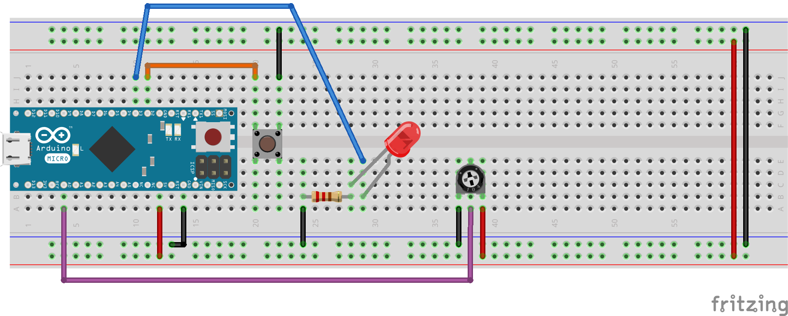

# Analog inputs and PWM outputs (IO)

This section shows the basics of analog inputs and outputs (PWM).

## Breadboard setup

This section assumes your breadboard is setup with power and LED connected as described in the [Digital inputs and outputs](DigitalIO.md) section and shown below:


## Reading an analog input

Complete code for this example: [2-1-1-read_potentiometer](examples/_2-1-1-read_potentiometer/_2-1-1-read_potentiometer.ino).

Analog inputs pins allow to read an analog voltage ranging between 0 and 5V and convert the voltage value to an integer value that can be used within the Arduino sketch. The source of the analog voltage can be from an analog circuit or the output of a sensor. For this example, we will use a 10k ohm potentiometer which is in fact a variable resistor.

Install the potentiometer on the breadboard as shown below. Connect the right-most pin of the potentiometer to the ground rail (black wire). Connect the left-most pin of the potentiometer to the 5V power rail (positive - red wire). Finally, connect the middle pin of the potentiometer to the Arduino analog input pin A0 (magenta wire). This forms a simple [resistive voltage divider circuit](https://en.wikipedia.org/wiki/Voltage_divider). When turning the potentiometer, the resistance on each side of the middle pin will change resulting in a variable voltage of 0 to 5V at the middle pin.



The sketch to read the analog input will have many points in common with that used to read the state of a push-button as well as some differences that we will see below.

In the Arduino IDE, create a new sketch and start by declaring the potentiometer pin number (A0) as a global variable of integer (`int`) type:

```Arduino
int potPin = A0;
```
In the `setup()` section, initialize serial communication with the computer. We will use the serial monitor to display the value read on the potentiometer pin:

```Arduino
Serial.begin(9600);
```

In the case of analog input pins, it is not required to declare the pin as an input. See the Arduino Analog Input Pins link in the [Useful resources](#useful-resources) section below for more details on the configuration of analog input pins.

In the `loop()` section, we will declare an integer (`int`) type variable to receive the value read from the analog input pin. Like we used the `digitalRead()` function to read the state of a digital input pin, we will use the `analogRead()` function to read the value of an analog input pin.

```Arduino
int potValue = analogRead(potPin);
```

Use the `Serial.println()` function to print the potentiometer value to the Serial monitor.

```Arduino
Serial.println(potValue);
```

Now compile the code and upload it to the Arduino. Open the [_Serial monitor_](https://www.arduino.cc/en/Guide/Environment#toc12) in the _tools_ menu. Turn the potentiometer counter-clockwise fully. The Serial monitor should show zeros or numbers close to zero. Turn the potentiometer clockwise fully. The Serial monitor should show 1023 or numbers close to 1023. Turn the potentiometer to intermediate positions and the Serial monitor should show intermediate values in the range 0 to 1023.

The Arduino analog pins use 10 bits Analog-Digital Converters (ADC). This means that the integer returned by the `analogRead()` command can take a maximum of 2^10 or 1024 different values, hence the range of 0 to 1023 observed on the Serial monitor. As you can see, the ADC maps the analog voltage range 0 to 5V to an integer value range of 0 to 1023.

To display the actual voltage in Volts, the integer value needs to be mapped back to a range of 0 to 5. To ensure a proper resolution, we will use a new variable of decimal floating point type (`float`) to store the voltage value. In the `loop()` function, before the `Serial.println();` statement, add the following:

```Arduino
float potVolts = float(potValue) * 5. / 1023.;
```
Note the use of the `float()` function to return a floating point value from the  `potValue` variable which is of integer type. Without the use of this function, the operand to the right of the assignment (`=`) operator would result in a integer value regardless of the fact that the potVolts variable is of floating point type. Also note the use of periods "." immediately following the constants 5 and 1023. These indicate to the compiler to consider these constants as floating point type. Although the Arduino IDE compiler takes care of converting the types of the operands to floating point if any of the operands are of floating point type, it is always a good practice to explicitly declare constants with the right type to avoid calculation errors related to type conversions.

To add the voltage value to the data printed to the Serial monitor, first modify the existing `Serial.println()` statement to `Serial.print()`. This way, we will be able to print additional data on the same line. Add a new `Serial.print()` statement to print a comma and a space followed by the `Serial.println()` statement for the voltage value. Your print statements should look like this:

```Arduino
Serial.print(potValue);
Serial.print(", ");
Serial.println(potVolts);
```

Compile the sketch and upload it to the Arduino. The Serial monitor should now show the analog integer value and the corresponding voltage separated by a comma.

## Using Pulse Width Modulation (PWM) to fade a LED

Complete code for this example: [2-1-2-read_potentiometer](examples/_2-1-2-led_fade/_2-1-2-led_fade.ino).

The Arduino, like most microcontrollers does not have Digital-Analog Converters that can output a variable voltage. The only outputs the Arduino can have correspond to the logic levels 0 (low) and 5V (high). Some devices like LEDs and motors can however be controlled using what is called [Pulse Width Modulation](https://en.wikipedia.org/wiki/Pulse-width_modulation) (PWM). Pulse Width Modulation alternates the output between _high_ and _low_ states at relatively high frequency. The percentage of time in _high_ state over a complete period (_high_ + _low_ states) is called the _Duty Cycle_ and defines the "intensity of the signal".

The Arduino `analogWrite()` function is used to output Pulse Width Modulation on specific pins. Not all Arduino pins support PWM output. On the Uno model, these are identified with a "~" sign. The Arduino pin mapping diagrams for all models identify the PWM capable pins with the (PWM) mention besides the pin number.

With our LED still connected to pin 3 as shown above, we will add an integer type (`int`) variable defining the led pin number below the potentiometer pin definition:

```Arduino
int ledPin = 3;
```

And set the led pin as an output in the `setup()` function:

```Arduino
pinMode(ledPin, OUTPUT);
```

As indicated in the Arduino Language Reference, the `analogWrite()` function takes an integer argument in the range of 0 to 255 corresponding to duty cycles of 0 to 100%. Since our potentiometer value variable has a range of 0 to 1023, we need to map this range to the 0 to 255 range. To do so, we use the Arduino `map()` function. See the Arduino Language Reference for details on the usage of the `map()` function.

At the end of the `loop()` function, declare a new variable of integer type (`int`) and assign it the output of the `map()` function:

```Arduino
int ledValue = map(potValue, 0, 1023, 0, 255);
```

Finally, to fade the LED brightness with PWM add the call to the `analogWrite()` function at the end of the `loop()` function:

```Arduino
analogWrite(ledPin, ledValue);
```

Compile the sketch and upload it to the Arduino. The led brightness should not change as the potentiometer is turned. [This simulation](https://circuits.io/circuits/4817521-analog-read-write-example) shows the same circuit and code with an oscilloscope connected to the LED pins, allowing visualization of the PWM signal.

## Useful resources

* Arduino Foundation: [Analog Input Pins](https://www.arduino.cc/en/Tutorial/AnalogInputPins)  
* Arduino Foundation: [Pulse Width Modulation (PWM)](https://www.arduino.cc/en/Tutorial/PWM)
* [Arduino Language Reference](https://www.arduino.cc/en/Reference/HomePage)

***

Return to the [home page](https://github.com/DrGFreeman/E2C-Arduino-Intro)

Copyright (c) 2017, Julien de la Bruère-Terreault, [drgfreeman@tuta.io](mailto:drgfreeman@tuta.io)  
This work is licensed under a <a rel="license" href="http://creativecommons.org/licenses/by-sa/4.0/">Creative Commons Attribution-ShareAlike 4.0 International License</a>.
<a rel="license" href="http://creativecommons.org/licenses/by-sa/4.0/"></a>
