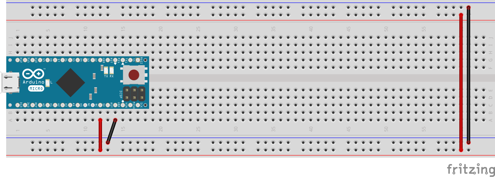
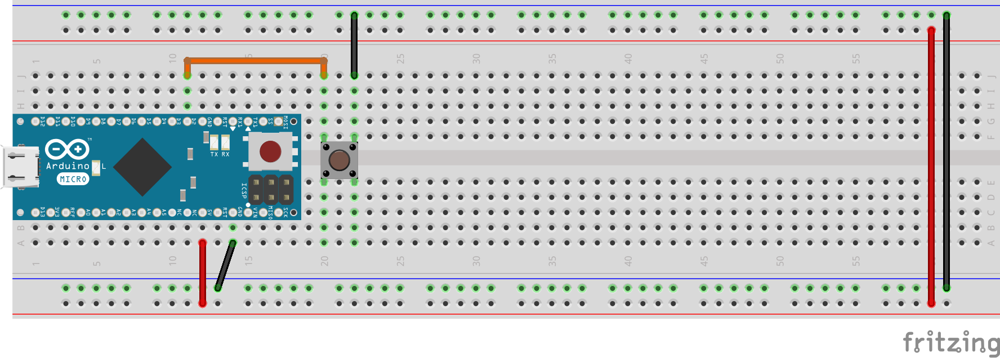
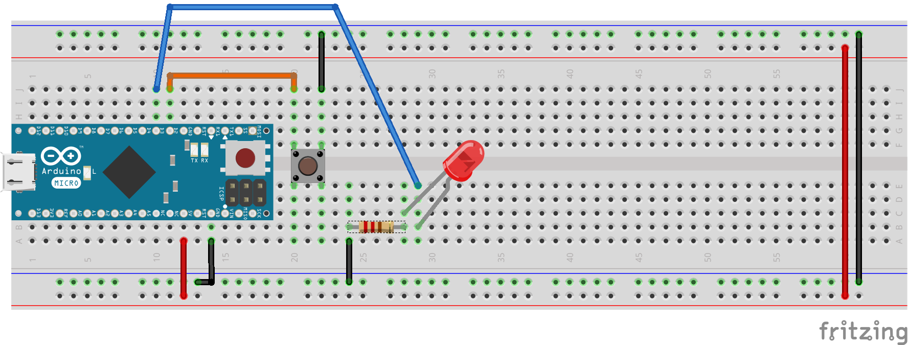

# Digital inputs and outputs (IO)

This section shows the basics of digital inputs and outputs.

## Powering the Breadboard

Before starting, lets connect the Arduino 5V and ground (GND) pins to the breadboard rails as shown below (blue side is ground (-), red side is 5V (+)). This will provide 5V power from the Arduino voltage regulator to the breadboard rails. It is also useful to power the second breadboard rail by running jumper wires accross the breadboard as shown.

## Reading a push-button (Input)

Lets start by installing a push-button across the middle of the breadboard as shown. Connect one leg of the push-button to the ground rail (black wire) and the other to digital pin 2 (orange wire). By default, the push-button circuit is open. When it is pressed, the push-button circuit will close, establishing a connection between digital pin 2 and ground.

Now lets start to code.

In the Arduino IDE, create a new sketch and start by declaring the button pin number (2) as a global variable of integer (`int`) type:

`int btnPin = 2;`

In the `setup()` section, initialize serial communication with the computer. We will use the serial monitor to display the button status:

`Serial.begin(9600);`

Still in the `setup()` section, declare the button pin as an input using the `pinMode` function:

`pinMode(btnPin, INPUT);`

The code located in the `setup()` section will execute only once at start-up whereas the code in the `loop()` section will execute over and over.

In the `loop()` section, declare a boolean (`bool`) type variable to store the button state and assign the return value of the `digitalRead()` function to the variable:

`bool btnState = digitalRead(btnPin);`

Finally, print the state of the button to the serial monitor:

`Serial.println(btnState);`

Your code so far should look like this: [1-1-1-read_pushbutton_input](examples/_1-1-1-read_pushbutton_input.ino)

Now compile the code and upload it to the Arduino. Open the _Serial monitor_ in the _tools_ menu. Press and release the button and look at the results in the serial monitor. A zero corresponds to a _low_ digital level (ground) and a one corresponds to a _high_ digital level (5V logic level).

What happens?

When the button is pressed, the button circuit is closed and the digital pin 2 is connected to ground. In this state, the serial monitor should show zeros only. Then why does the serial monitor not only shows ones when the button is released?

When the button is released, the digital pin 2 is neither connected to ground, nor connected to a 5V source. Since we set the pin mode of digital pin 2 to _INPUT_, the state of the pin is undefined and any noise or cross-talk from other pins can make the reading high or low. Consequently, the serial monitor can show zeros or ones randomly.

## Reading a push-button with input pull-up

To remedy this undefined pin state, the microcontroller offers the option of connecting the digital pin to 5V (high) via an internal resistor. This is called a _pull-up_ resistor because it "pulls" the pin state to a high state.

To set the pull-up resistor on pin 2, modify the line in the `setup()` section to specify pin mode using the constant `INPUT_PULLUP` instead of `INPUT`:

`pinMode(btnPin, INPUT_PULLUP);`

Recompile your code and check the serial monitor again.

Now the serial monitor should show a steady stream of ones when the button is released and a steady stream of zeros when the button is pressed.

Code for this example: [1-1-2-read_pushbutton_input_pullup.ino]((examples/_1-1-2-read_pushbutton_input_pullup.ino)

## Turning on an LED (output)

Our next step is to turn on an LED when the button is pressed.

Let's first start by adding the LED to the breadboard. LEDs like all diodes are polarized meaning the current can flow through them in only one direction. The longer pin of the LED is the _anode_ and must be connected to a positive (+) voltage whereas the shorter pin of the LED is the _cathode_ and must be connected to a negative (-) or ground voltage. To ensure proper voltage drop through the LED, a 220 ohm resistor must be connected in series with the LED. The side, positive or ground, where the resistor is located does not matter. In the case shown below, the resistor is connected between ground and the LED cathode (-, short leg). Connect the LED and resistor as shown below. Connect the LED anode (+, long leg) to the Arduino digital pin 3 (blue wire).

In the Arduino IDE, below the button pin declaration, declare the led pin number (3) as a global variable of integer (`int`) type:

`int ledPin = 3;`

In the `setup()` section, set the LED pin mode to `OUTPUT` using the `pinMode()` function:

`pinMode(ledPin, OUTPUT);`

Now we want to turn the LED on when the button is pressed. To do so, add an `if` statement that will execute the code within the curly braces {} only if the button state is true (equal to 1):

    if (btnState) {
      // Code here will execute only if btnState is true (1)
    }

The issue is that as we saw in the previous example, because we set the button pin mode as `INPUT_PULLUP`, the `btnState` variable is true (1) when the button is released and false (0) when the button is pressed. To change this behavior, we will modify the line where we assign the result of the `digitalRead()` function to the `btnState` variable by adding the _logical NOT_ operator `!` in front of the call to `digitalRead()` function.

`bool btnState = !digitalRead(btnPin);`

This _logical NOT_ operator will invert the results of the `digitalRead()` function so `btnState` will now equal zero when the button is released and one when the button is pressed.

Back to our `if` statement, we now want to turn on the LED when the `btnState` variable is true. To do so, add the `digitalWrite()` function within the `if` statement block:

    if (btnState) {
      digitalWrite(ledPin, HIGH);
    }

We use the `HIGH` constant to indicate to turn the LED on.

Compile this code and upload it to the Arduno. Once the upload has completed, press the button, hold it for a moment and release it.

The LED turns on when pressing the button but it stays on when releasing it. Why is that?

This is fairly simple: The first time the code within the `if` statement is executed (when the button is pressed), the microcontroller sets the digital pin 3 to HIGH (5V) state. When the button is released, the code within the `if` statement is not executed, however, there is no other instruction in the loop to set the pin state to LOW (ground).

To fix this, add an `else` statement right after the end of the `if` statement block. The code within the `else` statement block will execute every time the `if` statement condition evaluates to false (0), that is when the button is released. Within the `else` statement block, use the `digitalWrite()` function again, this time with the constant `LOW` to turn off the LED:

    if (btnState) {
      digitalWrite(ledPin, HIGH);
    }
    else {
      digitalWrite(ledPin, LOW);
    }

Recompile the code and upload it to the Arduino.

This time, the LED should behave as expected; on when the button is pressed and off when the button is released.

Code for this example: [1-2-1-led.ino]((examples/_1-2-1-led.ino)

## Toggling on and off an LED

What if we would like to change the behavior of the system so that the pressing the button toggles the LED on and off without the need to hold the button?

To achieve this behavior, we will need an additional global variable to store the state of the LED. As this variable will have only to possible states (on and off), we can use a boolean `bool` type. We also need to set the initial state of the variable to zero (off). Add the following line below the LED pin declaration:

`bool ledState = 0;`

To toggle the LED, we will write a custom function that, when called, will check the current LED status and turn on or off the LED accordingly.

Below the `loop()` block, add the function block:

    void toggleLED() {
      // Function code will go here
    }

The `void` statement before the function name indicates the type returned by the function at the end of its execution. In this case, `void` means the function does not return anything.

To toggle the LED we need check its current status and then turn it off if it is currently on or turn it on if it is currently off. Use `if` and `else` statement blocks along with the `digitalWrite()` function to do this:

    void toggleLED() {
      if (ledState) {
        digitalWrite(ledPin, LOW);
      }
      else {
        digitalWrite(ledPin, HIGH);
      }
    }

The above code will effectively toggle the LED once but will not work if we do not also change the value of the `ledState` variable each time we toggle the LED. Add two lines in the `if` and `else` statement blocks to change the `ledState` variable value:

    void toggleLED() {
      if (ledState) {
        digitalWrite(ledPin, LOW);
        ledState = 0;
      }
      else {
        digitalWrite(ledPin, HIGH);
        ledState = 1;
      }
    }

This function now should do the work. Now back to the `loop()` section.

As we are changing the behavior significantly, keep only the first line where we read the button state and assign it to the `btnState` variable. The `loop()` section should look like this:

    void loop() {
      bool btnState = !digitalRead(btnPin);
    }

We will again use an `if` statement to take action when the button is pressed. However, this time we want to take action only when the button _changes_ state from released (0) to pressed (1) so that the LED does not continuously toggles if the button is held pressed. To achieve this, we will need another global variable to track the button state in the previous pass of the loop. Under the `ledState` variable declaration, add the previous button state global variable as a boolean `bool` type and initialize it to zero:

`bool prevBtnState = 0;`

At the end of the `loop()` section, assign the `btnState` value to the `prevBtnState` variable for use in the next pass of the loop:

    void loop() {
      bool btnState = !digitalRead(btnPin);

      prevBtnState = btnState;
    }

Now time to add the `if` statement to the loop (in between the two existing lines in the `loop` section). Here we want to execute the `if` statement block only when the button is pressed _and_ was not previously pressed. This means the are two conditions to be met simultaneously to enter the `if` statement block. This is done by using the _logical AND_ operator `&&` between the two conditions to be verified. To do so, add the following conditional statement:

    if (btnState && !prevBtnState) {
      // Code to be executed will go here
    }

The _logical NOT_ operator `!` is used in front of the `prevBtnState` variable since we want this to return true (1) when the previous state of the button was false (0). In other words this statement means "Enter the block if the current button state is pressed and the previous button state was NOT pressed".

Inside the `if` statement block, we want to call the `toggleLED()` function we defined previously:

    if (btnState && !prevBtnState) {
      toggleLED();
    }

Compile and upload the code to the Arduino. Test it by pressing and releasing the button multiple times. The behavior should be pretty much as expected however, if you press the button quickly, you may notice that the response is not always as expected. What happens is that in the transitions, the button can generate multiple consecutive state changes within a short period. This is called "bouncing". Since the Arduino loop executes in less than a millisecond, these button state changes can be captured without being visible to the human eye, yielding undesired results.

To avoid this issue, simply add a short delay (50 milliseconds should do) within the `if` statement block using the `delay()` function:

    if (btnState && !prevBtnState) {
      toggleLED();
      delay(50);
    }

This will cause the program execution to pause for a short time after the first button state change is detected. Adding the delay within the `if` statement block ensures the main loop is not slowed down at every pass but only when the button state changes the first time.

Recompile the code and upload it to the Arduino. This time the behavior should be stable and robust.

Code for this example: [1-2-2-led_toggle.ino]((examples/_1-2-2-led_toggle.ino)

Return to the [home page](https://github.com/DrGFreeman/E2C-Arduino-Intro)

Copyright (c) 2017, Julien de la Bruère-Terreault, [drgfreeman@tuta.io](mailto:drgfreeman@tuta.io)  
 This work is licensed under a <a rel="license" href="http://creativecommons.org/licenses/by-sa/4.0/">Creative Commons Attribution-ShareAlike 4.0 International License</a>.
